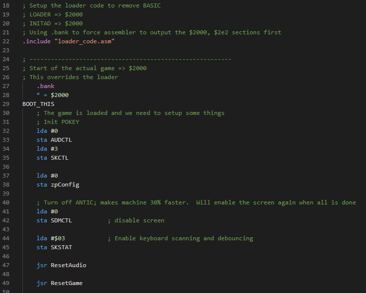
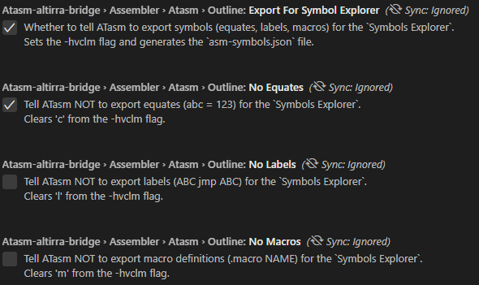
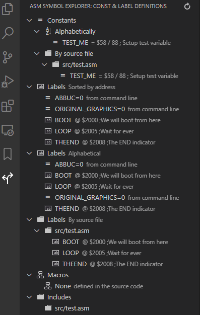
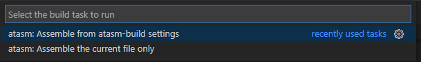
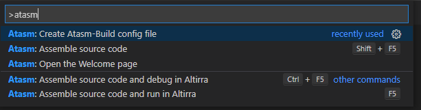
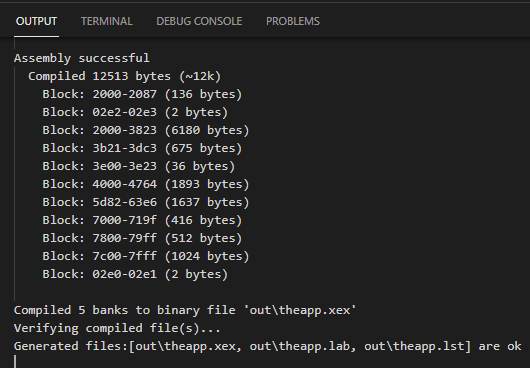
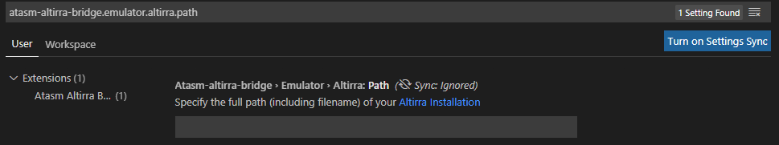
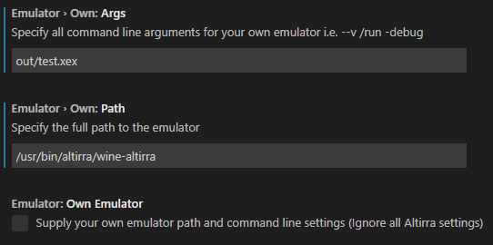
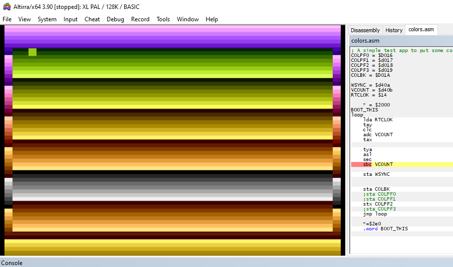

# ATasm Altirra Bridge - write 6502 code, assemble, run and debug all in one
This extension lets you code your Atari 8 bit assembler projects using a modern tool chain.

Write in VSCode and use the status bar icons or keyboard shortcuts to assemble, run and debug your project. Set breakpoints and debug with ease. Use the symbol explorer to quickly navigate to parts of your code (currently only available with ATasm)

## Features
This extension includes the following features:
* 6502 assembler syntax highlighting
* Cross-platform macro assembler (ATasm).
* Run your code in the Altirra emulator (or setup another one)
* Source level debugging with breakpoints
* Constant/Label/Macro explorer to quickly navigate to parts of your code
* Optional settings to use mads (https://mads.atari8.info/mads_eng.html) as your assembler

## Syntax Highlighting


## How do I start?
By default the extension will create a build configuration file (`atasm-build.json`). You can edit that file to set which is your primary assembler file or supply parameters to be used when executing the assembler.

So for an easy start.  Just create an assembler file named `theapp.asm`, add some code, and press F5 to assemble. That should build and run your code.
If there was no build configuration file, one will be created, and you can retry the assembly by pressing F5 again.

By default the file to assemble is called `theapp.asm`. Don't like it? Change it in the input field to whatever you prefer.

Sometimes you just don't want to pollute your folder with the build config file.  In that case there are various options available to you.
- Turn OFF the `Force Use Of Build Config File` setting.
   Ctrl+, to get to the settings.
   Type `atasm` into the search bar.
   Look through the options and turn off the setting.
   Now the assembler will not force a build config file on you various other options are now available.
- If the `Default Asm File To Assemble` setting is set then this will be the file that will be assembled.
- If there is no default asm file set then the current open assembler file will be assembled.
  Unless you've turned OFF the `Assemble Current Asm File` option
- If you do not use the build config file, have not set the default assembler file, have turned off the assembling of the current file in the editor then the first assembler file is the current folder is assembled.
  What comes first.  Well the sort order can be switched between alphabetical and last modified.

Those are quite a few options and should cover most use cases!

For a project use a build configuration!

For some simple testing turn off the build configuration and do not set a default assembler filename.
This will assemble the currently open file or use the first alphabetical or last modified file.

### What makes a file an assembler file?
If the file extension is one of these:
- .asm
- .a
- .s
- .m65

### Special case
If you want to use some special command line switches but still use the file select options from have then turn ON the `Force Use Of Build Config File` option AND clear the `input` JSON setting.
When the `input` is empty the above search rules also get applied. The good thing here is that the command lines switches from the build config are used.

## Symbol Explorer
Use the  icon to switch to the `Asm Symbol Explorer`.

This tool shows data exported by the `ATasm` assembler. Use the `-hv` switch in the `params` section to generate the data, or use the `Export For Symbol Explorer` setting.

```
atasm-build.json
    "_4": "Additional atasm parameters:",
	"params": "-hv",
```

or use the settings as shown in this image.



The demo file below will produce the data shown in the image below:
```
	* = $2000
TEST_ME = 88 		; Setup test variable
BOOT				; We will boot from here
	LDA #1
	STA TheEnd
loop JMP loop		; Wait for ever
TheEnd .byte 0		; The END indicator
```


The first item shows that the `TEST_ME` constant has a value of 88 (in hex $58) and what the comment for the definition is. Clicking on the `TEST_ME` symbol will take you to the line where the symbol is defined in the source file.

The second section show labels sorted by address/memory location:
`ORIGINAL_GRAPHICS` was set to 0 on the command line, in this case in the `_5`/`symbols` section of the `atasm-build.json` file.
```
atasm-build.json
    "symbols": [
		"ORIGINAL_GRAPHICS=0"
	],
```

The `BOOT`, `LOOP` and `THEEND` symbols where defined in the assembler source code. The location in memory together with source comment is shown. If you hover the cursor over the symbol the origin in the source file is shown. In this case `LOOP` is at address $2005 and it's source comment is `Wait for ever`.

## Build tasks and shortcuts for building you assembler projects
The extension registers build tasks for 6502 assembly files which invoke `ATasm` on the file
currently beind edited (Ctrl + Shift + B). 
If you have a `atasm-build.json` configuration file in your workspace folder then a task will be created for the defined project. 

The build tasks allow you to quickly assemble your code.  By default output goes to the `out` folder with a `.xex` extension.

## ATasm/Altirra
For a full integration with the `Altirra` emulator you need to create the `atasm-build.json` configuration file. This allows you to optionally specify the name of the input file which is passed to the assembler as well as any additional parameters.

```json
{
	"input": "theapp.asm",
	"includes": ["music"],
	"outputFolder": "out",
	"params": "-v",
	"symbols": ["TEST=1"],
	"withDebug": true
}
```

There is no need to create this file by hand.  You can use the status bar shortcut buttons:
 

or the command pallette (Ctrl+Shift+P then type atasm)


to create the file.

Pressing the gear icon will create and open the configuration file.
- `input` - the first file in your project.  This will `.include` all others. `theapp.asm` by default.  Change this to the name of your game or application, or leave it blank to assemble the first .asm file found in the folder.
- `includes` - a list of folders that will be searched for files when they are included.
- `outputFolder` - the location relative to your workspace where the assembler output will be written to.  This is `out` by default.
- `params` - The extra ATasm parameters you want to specify. i.e. -v for verbose output
- `symbols` - An array of predefined symbol definitions. i.e ["VERSION=1","TEST=0"]
- `withDebug` - Boolean value of `true` will create a symbol and listing file that will help with Altirra debugging.

### Build
The VSCode status bar allows for quick access to the `Build` (Shift + F5), `Build and Run` (F5), and `Build and Debug` (Ctrl + F5) commands.

The build  button will run ATasm with the configured parameters.  Output and status messages go to the `OUTPUT` console. 



### Build and Run
The first time the build and run  button is pressed the extension will verify if `Altirra` (or another emulator) has been setup and its location on the machine configured. It its not configured then the following screen will be shown. Enter the location of your Altirra emulator location including the executable filename. i.e. D:\Altirra\3.90\Altirra64.exe or /usr/bin/altirra/wine-altirra



Once a reference to Altirra has been added you can run your project code directly from VSCode.

If your system does not allow you to run Altirra or you want to use another emulator you can confiure the path and command line for it.


You need to supply all the arguments in the correct format, the extension would not know how to format the arguments. .i.e. Would an arguement start the --, -, or /.

### Build and Debug
The real power of the extension comes in the form of the Altirra debugger. Pressing the build and debug  button will not only create the binary file, but also a file containing the `symbol` definitions and a `list` file. The list file maps every line number of the project to a memory location. This allows us to do source level debugging and to set break points in the assembler code and have Altirra hit them when the program is executed.

Here is what source level debugging with a hit breakpoint looks like in Altirra



## Installing and configuring

### ATasm and Altirra
A version of the [ATasm](https://github.com/CycoPH/atasm) macro assembler ships with this extension. The Linux x64 and Windows x64 binaries are included.

Altirra can be downloaded from [here](http://www.virtualdub.org/altirra.html). A description on how to configure it can be found in the [Retro Coding Blog](https://retro.cerebus.co.za/blog/asm/chapter1/).

### Mads as an alternative assembler
If you prefer using the every popular MAD-ASSEMBLER (mads) (https://mads.atari8.info/mads_eng.html) then you can setup a the path to it, switch the plugin settings to `Mads` and do nearly all the things you can do with `ATasm`.  The switch is located under `Which Assembler` in the settings.

The only plugin feature not available to `Mads` users is the `Symbol explorer`

### Updating the extension
Updates are regularly provided and you will be notified via VS Code when one has been made available. Once an update has been installed you will generally be prompted to restart VS Code.

## 6502 sample

```asm
; A simple test app to put some color on the screen
COLPF2 = $d018
COLBK = $D01A
WSYNC = $d40a
VCOUNT = $d40b
RTCLOK = $14

	* = $2000
BOOT_THIS
loop
	lda RTCLOK
	tay
	clc
	adc VCOUNT
	tax

	tya
	asl
	sec
	sbc VCOUNT

	sta WSYNC

	sta COLBK
	stx COLPF2
	jmp loop

	*=$2e0
	.word BOOT_THIS
```

## Requirements

The [Altirra](http://www.virtualdub.org/altirra.html) emulator needs to be installed to run and debug your code.

Should you want to use `Mads` as your assembler then you will need to setup the path to it.

## Extension Settings

There are various settings that control aspects of this extension.  To access them open the settings (Ctrl+,) and select `Atasm Altirra Bridge` from the extensions.
Or simply type 'atasm' into the search bar and all settings will be shown.

This extension contributes the following settings:

* `atasm-altirra-bridge.assembler.whichAssembler`: `ATasm` or `Mads`. Select which assembler is being used by the plugin. Defaults to `ATasm`
* `atasm-altirra-bridge.assembler.atasmPath`: If you wish to use your own version of ATasm (and not the one shipped with the extension) then set the path to it here
* `atasm-altirra-bridge.assembler.madsPath`: If you wish to use `Mads` as your assembler then set the path to it here and switch the `Which Assembler` setting to `Mads`
* `atasm-altirra-bridge.assembler.atasm.outline.ExportForSymbolExplorer`: Whether to tell ATasm to export symbols (equates, labels, macros) for the `Symbols Explorer`. Sets the -hvclm flag and generates the `asm-symbols.json` file.
* `atasm-altirra-bridge.assembler.atasm.outline.noEquates`: Tell ATasm NOT to export equates (abc = 123) for the `Symbols Explorer`. Clears 'c' from the -hvclm flag.
* `atasm-altirra-bridge.assembler.atasm.outline.noLabels`: Tell ATasm NOT to export labels (ABC jmp ABC) for the `Symbols Explorer`. Clears 'l' from the -hvclm flag.
* `atasm-altirra-bridge.assembler.atasm.outline.noMacros`: Tell ATasm NOT to export macro definitions (.macro NAME) for the `Symbols Explorer`. Clears 'm' from the -hvclm flag.
* `atasm-altirra-bridge.editor.clearPreviousOutput`: Whether to clear the previous output window everytime the assembler is triggered.
* `atasm-altirra-bridge.editor.saveAllFilesBeforeBuild`: Whether to save all files before build is triggered.
* `atasm-altirra-bridge.editor.saveFileBeforeBuild`: Whether to save the active file before build is triggered.
* `atasm-altirra-bridge.editor.showAssemblerOutput`: Whether to show the assembler messages in the output window.
* `atasm-altirra-bridge.editor.statusBarCommands`: Show information and feature short-cuts on the Status Bar.
* `atasm-altirra-bridge.emulator.altirra.path`: Specify the full path to the Altirra emulator.
* `atasm-altirra-bridge.emulator.altirra.args`: Specify (optional) Altirra command line arguments.
* `atasm-altirra-bridge.emulator.altirra.autoCloseRunningAltirra`: Automatically close any existing Altirra instances before opening a new one.
* `atasm-altirra-bridge.emulator.altirra.singleInstance`: Only run a single instance of the emulator.
* `atasm-altirra-bridge.emulator.altirra.region`: Run Altirra in PAL or NTSC region
* `atasm-altirra-bridge.emulator.ownEmulator`: Whether to run Altirra or another emulator (own)
* `atasm-altirra-bridge.emulator.own.args`: All arguments passed to the own emulator. The extension does not add any.
* `atasm-altirra-bridge.emulator.own.path`: Full path to your own emulator.
* `atasm-altirra-bridge.application.configuration.showNewVersionMessage`: Show welcome message after installing a new release of Atasm Altirra Bridge.
* `atasm-altirra-bridge.application.configuration.forceUseOfBuildConfigFile`: Use the `atasm-build.json` build configuration file for this project? If ON then the build config file is required. If one does not exist, a default will be created. If OFF then the first assembler file in the project folder is assembled with the default DEBUG command line switches.
* `atasm-altirra-bridge.application.configuration.defaultAsmFileToAssemble`: Set the default .asm file to build. i.e `theapp.asm`. Leave blank to assemble the first assembler file found in the folder, depending on the sort order.
* `atasm-altirra-bridge.application.configuration.assembleCurrentAsmFile`: When set then the currently open assembler file will be assembled. Only applies if no build config is used and no default asm file is set.
* `atasm-altirra-bridge.application.configuration.findFirstFileBy`: This applies when there is no build config file, there is no default assembler file, and the current file is not an assembler file. Then find the first assembler file in the folder by which sort order? Filename A-Z or Last modified date.
* `atasm-altirra-bridge.viewer.memory.size`: The memory map viewer breaks the display into smaller blocks. This sets the block size: 128 bytes to 4KB
* `atasm-altirra-bridge.viewer.memory.roms`: Show Rom Segments Next To Program Segments


## Known Issues

## Release Notes

### 1.9.1
- Atasm with .INIT and .RUN directives
- When running the emulator the first two parameters are: /run xex
- 
### 1.9.0
- Atasm version bump to 1.25
- The use of the atasm-build.json file is now optional.
  - You can disable the `Force Use Of Build Config File` options to disable the option.
  - When disabled the file to assemble is selected by one of these
	* The entry in `Default Asm File To Assemble`. Can be blank then the next options apply
	* Looks if the current editor file is an assembler file [Has extension .asm, .a, .s, .m65, .inc]
	* Looks at the alphabetical first assembler file
	* Or the last modified assembler file

### 1.8.0
- Atasm version bump to 1.20
- Atasm now exports a "Memory Map" which the extension parses and shows as an "Atasm Assembler memory viewer"
  - Gives a nice layout of the used memory
  - To name memory sections you can use a string behind the *=\<addr> directive like: *=$200 "Booting from here"
  - or use the .NAME "Music" directive to tell Atasm that this is a section with Music in it

### 1.7.0
- Atasm version bump to 1.18
- Atasm can now export comments on the same line where equates (a=123), labels (abc) and macros (.macro) are defined
  - Use	the `-hv` command line option to export the comments with the symbols
  - Or use the Export For Symbol Explorer setting (with its three exclusion options)
  - The extension tracks changes to the 'asm-symbols.json' file and updates the symbol explorer accordingly.
- You can now configure the extension to only run a single instance of the Altirra emulator

### 1.6.0
- Atasm version bump to 1.17
- Atasm can now dump constant, label and macro definition information to a file
  - use command line switch *-hv* to dump all the info
  - use -hv[clm] c=constant l=labels m=macros to select a subset of info to dump
  - `-hvc` only dumps the defined constants
  - `-hvl` only dumps information about labels
- The 'asm-symbols.json' file in the root of the project can be viewed in vscode via
  a new `Asm Symbol Explorer`. Clicking on any of the constants, labels, macros or included
  files will take you to the source code instantly.

### 1.5.0
- Atasm version bump to 1.13
- Atasm can now generate CC65 header and atasm include files from your project
  - use -hc switch to generate a CC65 header file
  - use -ha switch to generate an atasm include file

### 1.4.0
- Atasm version bump to 1.12

### 1.3.0
- MacOS support
- Added a MacOS x64 atasm executable

### 1.2.0
- Better integration of the ATasm assembler
- Fixed a bug that reset the path to be always the Windows path of the atasm
- Build Task now also works when 'atasm-build.json' is the currently open file
- Added configuration options to allow for another emulator to be used
  - Set the ownEmulator setting and supply the path and arguments
  - The extension will not add any parameters. You will need to supply them in the correct format.
